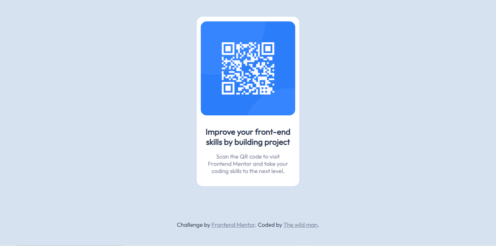

# Frontend Mentor - QR code component solution

This is a solution to the [QR code component challenge on Frontend Mentor](https://www.frontendmentor.io/challenges/qr-code-component-iux_sIO_H). Frontend Mentor challenges help you improve your coding skills by building realistic projects. 

## Table of contents

- [Overview](#overview)
  - [Screenshot](#screenshot)
  - [Links](#links)
- [My process](#my-process)
  - [Built with](#built-with)
  - [What I learned](#what-i-learned)
  - [Continued development](#continued-development)
  - [Useful resources](#useful-resources)
- [Author](#author)

**Note: Delete this note and update the table of contents based on what sections you keep.**

## Overview

### Screenshot



### Links

- Solution URL: [Solution URL here](https://github.com/Twm111/Front)
- Live Site URL: [live site URL here](https://twm111.github.io/Front)

## My process

The process isn't clear cause I've freshly finish a tutorial and but thanks to [freecodecamp](https://freecodecamp.org) I know where to start. But it's basically something similar to this
  - HTML : The skeleton
  - CSS : I've taken care of the desktop view first and adding the media queries at the end

### Built with

- Semantic HTML5 markup
- CSS custom properties
- Flexbox
- For styles

### What I learned

I've more in this project than I can tell. I think now I understand when people say that it's in projects that you learn more

* For example about media queries 

```css
@media only screen and (max-width: 1024px) {
	main {
		width: 27%;
	}
}
```

* And some landmarks

```html
<main class="qr-code">
					
					<div id="text">
						<h1>Improve your front-end skills by building  project</h1>
					<p>Scan the QR code to visit Frontend Mentor and take your coding skills to the next level.</p>
					</div>
		</main>
		<section class="attribution-section">
			<div class="attribution">
				Challenge by <a href="https://www.frontendmentor.io?ref=challenge" target="_blank">Frontend Mentor</a>. 
				Coded by <a href="#">The wild man</a>.
			</div>
		</section>
</main>
```


### Continued development

I think one of the areas I need to improve is the responsive part


### Useful resources

- [W3SCHOOLS](https://www.w3schools.com) - This helped me for CSS and HTML documentation. I really liked this pattern and will use it going forward.


## Author

- Website -I dont have a website yet but I will think about it in the future
- Frontend Mentor - [@Twm111](https://www.frontendmentor.io/profile/Twm111)
- Twitter - [@JellTwm](https://www.twitter.com/JellTwm)

